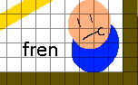

# Level synopsis
_Settled in the long-flooded forests, the Canid Tribes were forsaken ages ago by the standard kin of man due to their worship of wild spirits. They have since diverged wildly from humanity, delving into cruel magic to twist themselves into brutish, powerful forms._

This is a basic intro level that will pit the player, with basic stats, up against the __Canid Tribes__, who have taken them and another person hostage. It's up to you to find your way out, collect memories, and get past the dangerous canid general, __Bone Biter Melburns__.

## Key to the map:
* __BROWN BLOCKS:__ This is terrain. It's impassible, you can stand on it, and it's useful and sturdy.
* __YELLOW BLOCKS:__ This is platforms that can be passed through by crouching, then jumping. Used mainly as thin floors for stuff such as planks or ladder rungs.
Most of the other stuff on the map is badly drawn representations of stuff. To explain some of the symbols:

## Key to other stuff:
*  __Checkpoint/MemoryGate:__ These are the "bonfires" of this game. If you die, you respawn at one of these, and resting at one will restore all your HP, status, and will revive all enemies in the level. Later iterations of the game will let you teleport yourself back to the hub world and such to level up etc.
* __Chest:__ It's got an item in it, and the name of what it is is displayed above it. For some chests, this might be a key or something else useful.
* __Lever:__ Pull the lever, and it'll affect the map in some way, usually indicated with some arrow.
* __Gate:__ These are solid platforms that can only be removed if you use the correct-color key on it.

## Enemies:
A couple general guidelines for all the enemies for poses is that they'll have some shared poses:
* Idle: Out of combat, at ease.
* Combat: Combat stance activated. They know you're there.
* Walking: Basic movement across the ground.
* Falling: For if an enemy falls off a ledge, or spawns in midair.
* Staggered: They've taken enough hits to be thrown off-balance.
* Death: They ded.

* __Blade:__ Carries a sword and shield, will block you if you attack blindly. Not aggressive, but they are reactive and focus on standing their ground and stopping you from getting through.
  * _Blocking_ - Holding shield upwards in front. Should form a nice flat wall-like surface. Might also want to include a walk cycle for this, moving forward and back with guard up.
  * _Attack_ - Telegraphed overhead sword swing. Hits in a wide arc overhead and above, but has a lot of after-attack lag.
* __Arrow:__ Shoots at you with arrows. If you get near, they usually will attempt to hop away rather than continue firing.
  * _Shoot_ - Drawing back and firing an arrow. I'd actually advise on making the upper and lower body separate for this, as the intent is that this guy can aim the arrow in arcing patterns.
  * _Dodge_ - Leaping backwards, out of danger. Or into a pit by accident. 
* __Cloak:__ Swift and sneaky. These enemies can hop from platform to platform to follow you, but aren't very sturdy.
  * _Jump_ - Leaping forwards from platform to platform.
  * _Hop_ - This might be a good stand-in for a walk cycle on these guys. I picture them hopping around erattically to avoid attacks and try and mix you up.
  * _Stab Lunge_ - Forward lunge across the ground, should look good sliding across the ground.
  * _Hiding_ - Crouched down, easy to place in pesky foreground elements for ambushes.
* __Bone-Biter Melburns:__ The boss of the level. Weilds a big torch-hammer and likes impeding your process and burning bridges.
  * _Ground Burn_ - Throws out a trail of fire in front of them (make the fires a separate sprite). Used for when he burns the bridge between you and him, as well as an attack during his fight.
  * _Punch_ - Throws out a slow punch that knocks you across the room.
  * _Stomp_ - Used if you're staying way too close to him, sends out a shockwave around his location, has an extremely long windup.

* This is a placeholder NPC friend.
  * _No animations really necessary except for like an idle._

The Git has both a png file for standard viewing, and a *pdn* file, which can be opened using [paint.net](https://www.getpaint.net/)
